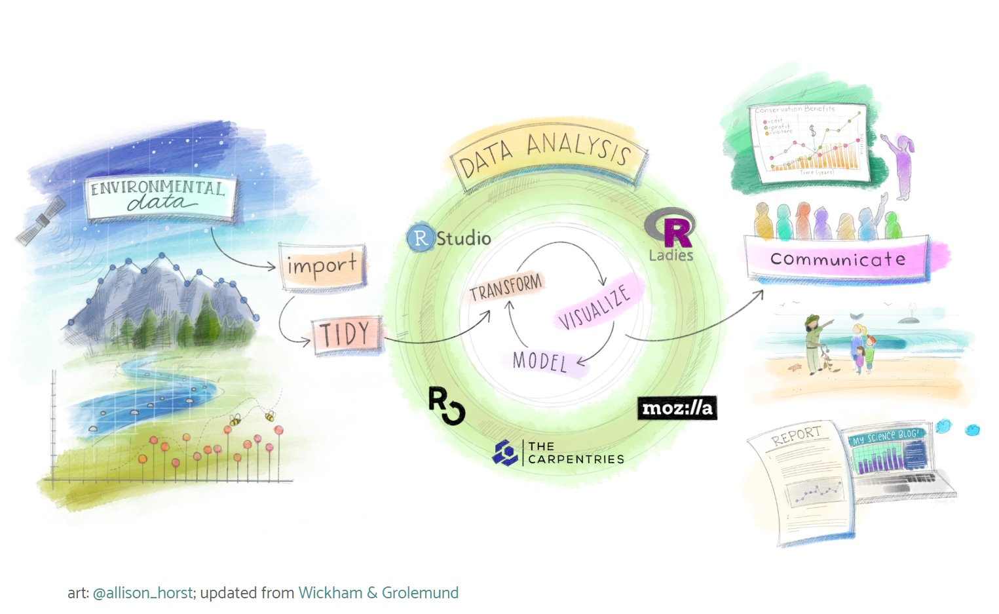
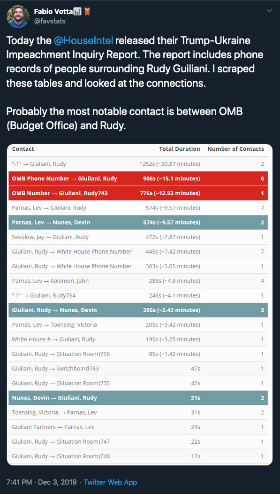

```{r setup, include=FALSE}
knitr::opts_chunk$set(echo = FALSE)
```

## #rstats on twitter

- RStudio hired a Artist in Residence
- [allison_horst](https://twitter.com/allison_horst)



- [RLadies](https://twitter.com/WeAreRLadies)
- [RLadiesGNV](https://twitter.com/RLadiesGNV)

## #rstats on twitter

- Example of a very short reproducible project.



- [tweet](https://twitter.com/favstats/status/1202025063807168512)
- [link to code on github](https://gist.github.com/favstats/e21b021a2f923ffea129122181249356)

## Reproducible Research

"Research is defined as reproducible when then published results can be replicated using the documented data, code, and methods employed by the author or provider without the need for any additional information or needing to communicate with the author or provider." [NNLM](https://nnlm.gov/data/thesaurus/reproducible-research)

"Reproducible research is the idea that data analyses, and more generally, scientific claims, are published with their data and software code so that others may verify the findings and build upon them." [Peng et al.](https://www.coursera.org/learn/reproducible-research)

### Why?

- Two Main Reasons according to [R-OpenSci](https://ropensci.github.io/reproducibility-guide/sections/introduction/)
  1. "to show evidence of the correctness of your results"
  2. "to enable others to make use of our methods and results"
- Selfish Reasons [Florian Markowetz 2015](https://genomebiology.biomedcentral.com/articles/10.1186/s13059-015-0850-7)
  1. helps to avoid disaster
  2. makes it easier to write papers
  3. helps reviewers see it your way
  4. enables continuity of your work
  5. helps to build your reputation
- Even if your research is not fully reproducible, techniques shown in this workshop will be useful for you!
  
  
## Reproducible ***data anlysis***

### Steps of a reproducible research

1. Data collection
2. ***Data analysis***
3. ***Writing***
4. ***Publishing***

This workshop focuses on bullet points 2-4.

## Important tools for Reproducible research

- Document the project history (automatically!)
  - git (alternative: svn)
  - github.com or gitlab.com can be used to host git repositories online, for collaboration and sharing
  - [Happy Git and GitHub for the useR](https://happygitwithr.com/) is the ultimate ressource for learning git in R and RStudio
  - RStudio comes with git support, so you don't have to learn the git command line!
  - todays Workshop Material is organised in a git repository that is [available on github](https://github.com/tilltnet/w8_reproducible_research)
- Make the environment reproducible
  - packrat (easy: can be activated in RStudio in the project options)
  - system images (harder; docker, kubernetes, singularity or any virtual machine)
- A reproducible document format - RMarkdown
  - R + Markdown = RMarkdown
  - bibliography: [.bibtex and other formats supported](https://rmarkdown.rstudio.com/authoring_bibliographies_and_citations.html)
  
## What is Markdown?

- a lightweight markup language
- initially used for creating structured HTML files
- can now be used to author any kind of document (.doc, .pdf, ...), website, notes, books,
presentation, emails or documentation (This presentation is authored in Markdown!)
- RStudio supports Markdown, but a lot of other text editing tools and IDEs support it as well (Atom, VS Code, [dillinger.io](https://dillinger.io/), etc.)
- Tutorials: 
  - [www.markdownguide.org](https://www.markdownguide.org/getting-started/)
  - [guides.github.com](https://guides.github.com/features/mastering-markdown/)
- For the conversion of a Markdown File to any other document format the software [pandoc](https://pandoc.org/) is usually used.
- Fortunately RStudio takes care of most of these things in the background!
- Let's have a look at a simple markdown file!

## Let's get the workshop material from github.com

### using git :

- for this to work git needs to be installed on your system!
  - [Install Git](https://happygitwithr.com/install-git.html)
- Open RStudio
- File -> New Project -> Version Control -> Git
- Repository URL: https://github.com/tilltnet/w8_reproducible_research.git
- Choose local folder to create project folder in.

## A simple RMarkdown File

- Create RMarkdown file in RStudio
- Create R-Notebook file in RStudio

### RMarkdown an R Markdown flavor

- adds a YAML header, setting title, author, date and rendering options
- allows for the integration of R Code chunks (other languages are supported as well Pyton, Rcpp, SQL, Stan, D3, Bash)

## RMarkdown vs R-Notebook

- a lot of similarities, both are Markdown files, they are just rendered differently
- RMarkdown better for publication
- R-Notebook is a nice interactive version of RMarkdown
- You might want to start out with a R-Notebook and convert it to RMarkdown File later on

## Advanced options & inline R-Code

- activate Cairo renderer (in order to have nice plots on Windows!)
- using the cache to speed up rendering
- setting global options for figure size and chunk evaluation
  - chunk options have priority over global options
  
## (Some) Output formats

- HTML
- PDF (needs a Latex install on the system)
      
      install.packages('tinytex')
      tinytex::install_tinytex()

- docx
- ioslides
- slidy
- Powerpoint

- The following examples include items, that will not render properly in all target formats. Especially interactive elements and tables are usually only working right in HTML documents!

## Creating nice tables

- see: w8_examples_1.Rmd
- knitr::kable()
- [kableExtra](https://cran.r-project.org/web/packages/kableExtra/vignettes/awesome_table_in_html.html)

## Creating regression tables

- see: w8_examples_2.Rmd
- HTML: sjPlot::tab_model()
- HTML and PDF: stargazer::stargazer()

## Creating awesome tables

- see: w8_examples_3.Rmd
- colorful and flexible: [formattable](https://renkun-ken.github.io/formattable/)
- interactive: [reacttable](https://glin.github.io/reactable/articles/examples.html)

## Including bibliographies

- see: w8_examples_4.Rmd
- adding YAML option
- referencing in markdown text:


## Including interactive elements

- see: w8_examples_4.Rmd
- [visNetwork](https://datastorm-open.github.io/visNetwork/)
- [htmlwidgets](https://www.htmlwidgets.org/)


## When the article is getting longer: bookdown

- [rstudio/bookdown](https://github.com/rstudio/bookdown)
- [Happy Git and GitHub for the useR](https://happygitwithr.com/)
- [bookdown: Authoring Books and Technical Documents with R Markdown](https://bookdown.org/yihui/bookdown/)

## When a project gets complex...

- Start with an Rmd file
- write functions in separate files
- create unit tests
- move everything into a package
- [Rmd first](https://github.com/statnmap/course_material/blob/master/2019-11-06_rmd_first_method/2019-12-Meetup-R-Nantes.pdf)

## Exercise:

- Create an RMarkdown File
- load a dataset (other than mtcars)
```{r}
library(help = "datasets")
```
- display the first few cases of the dataset in a nice table
- create a nice frequency table
- create any kind of plot based on the dataset
- create a two step regression model and display the results in a nice table
- add references to the document and create a bibliography
- add any further elements you are interested in
- render the whole document to two different formats (doc, pdf, html)

